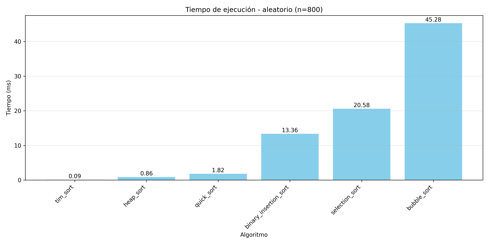
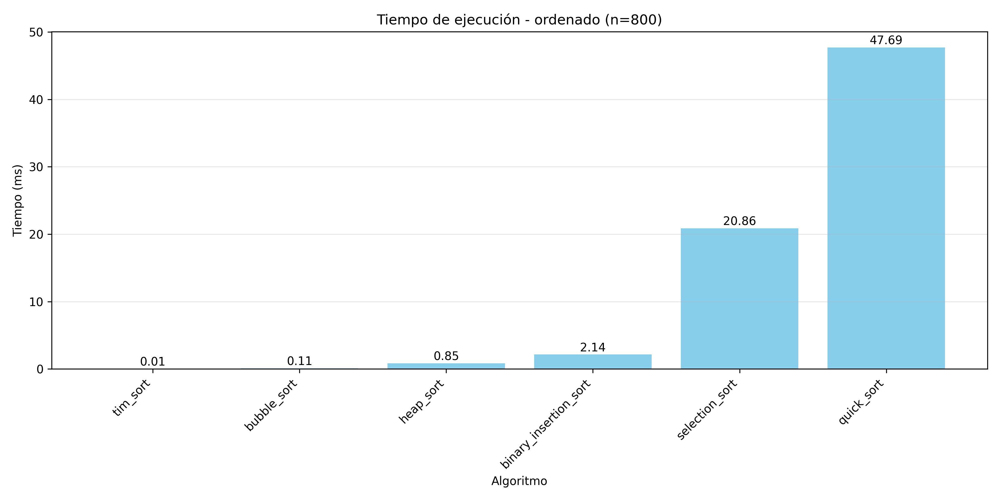
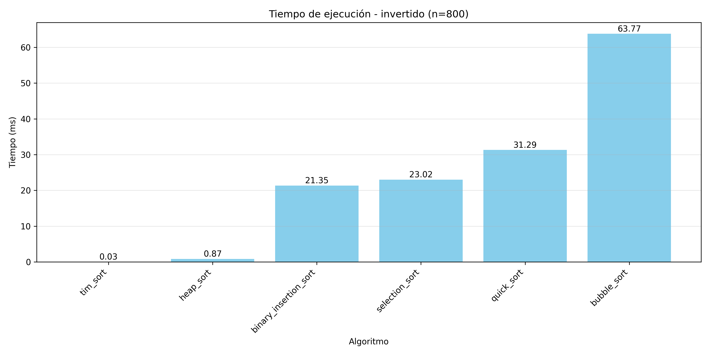
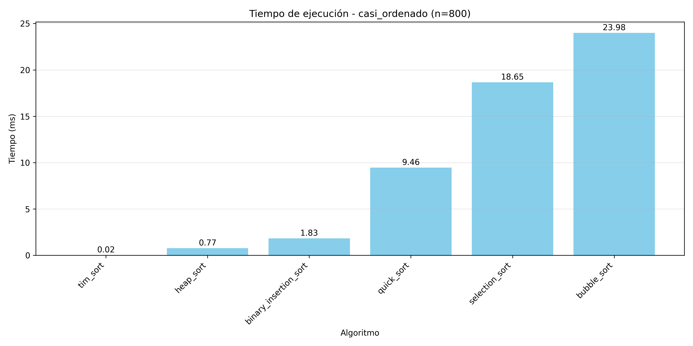
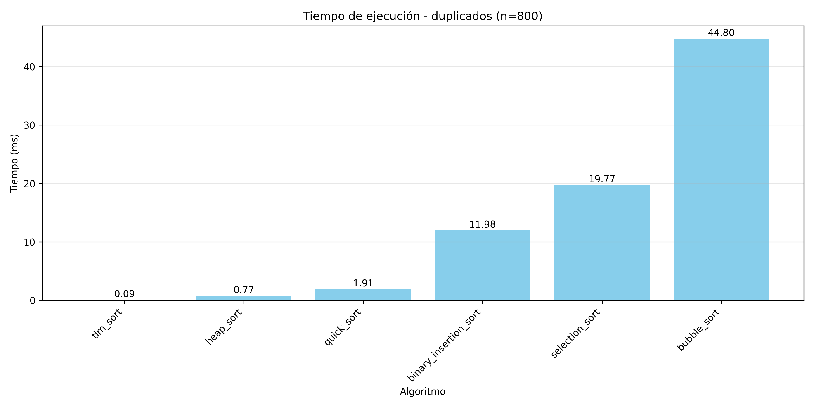
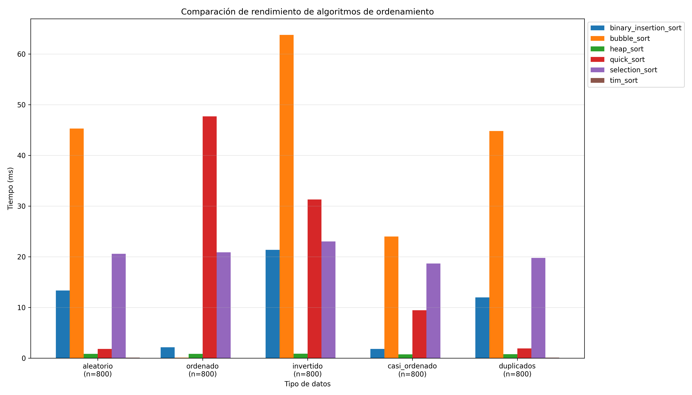

# Reporte de Pipeline

## Artefactos
- nlp_csv: C:\Users\Ismenia Guevara\Documents\Repositorios GIT\PracticasBigData\Entrega2\data\processed\unified_cleaned_nlp.csv
- features: C:\Users\Ismenia Guevara\Documents\Repositorios GIT\PracticasBigData\Entrega2\data\processed\features.npz
- index: C:\Users\Ismenia Guevara\Documents\Repositorios GIT\PracticasBigData\Entrega2\outputs\search\index.pkl
- labels: C:\Users\Ismenia Guevara\Documents\Repositorios GIT\PracticasBigData\Entrega2\outputs\clustering\labels.csv
- metrics: C:\Users\Ismenia Guevara\Documents\Repositorios GIT\PracticasBigData\Entrega2\outputs\clustering\metrics.json
- unify: {'cleaned_bib': 'C:\\Users\\Ismenia Guevara\\Documents\\Repositorios GIT\\PracticasBigData\\Entrega2\\data\\processed\\unified_cleaned.bib', 'duplicates_bib': 'C:\\Users\\Ismenia Guevara\\Documents\\Repositorios GIT\\PracticasBigData\\Entrega2\\data\\processed\\duplicates.bib', 'cleaned_csv': 'C:\\Users\\Ismenia Guevara\\Documents\\Repositorios GIT\\PracticasBigData\\Entrega2\\data\\processed\\unified_cleaned.csv'}

## Métricas de clustering
| Métrica | Valor |
|---|---:|
| silhouette | -0.03347134495935829 |
| calinski_harabasz | 1.036697148518139 |
| davies_bouldin | 0.9459741038647109 |

## Visualizaciones
### Publications Per Year

Conteo de publicaciones por año (matplotlib sobre columna 'year').

### Top Authors

Top autores tras expandir separadores comunes (barras horizontales).

### Cluster Sizes

Distribución de tamaños de cluster (conteos por etiqueta).

### Category Distribution

Heatmap de categorías por cluster (seaborn; matching por regex con límites de palabra).

### Silhouette

Histograma de valores de silhouette (sklearn, métrica coseno con submuestreo).

### Wordcloud

Nube de palabras a partir de frecuencias por categorías predefinidas (wordcloud).

### Wordcloud Top Words

Nube de palabras más frecuentes de 'abstract_clean' ya sin stopwords.

### Sorting Benchmark 1

Benchmarks de algoritmos de ordenamiento (tiempos medios en ms).

### Sorting Benchmark 2

Benchmarks de algoritmos de ordenamiento (tiempos medios en ms).

### Sorting Benchmark 3

Benchmarks de algoritmos de ordenamiento (tiempos medios en ms).

### Sorting Benchmark 4

Benchmarks de algoritmos de ordenamiento (tiempos medios en ms).

### Sorting Benchmark 5

Benchmarks de algoritmos de ordenamiento (tiempos medios en ms).

### Sorting Benchmark 6

Benchmarks de algoritmos de ordenamiento (tiempos medios en ms).

## Tablas generadas
| Tabla | Descripción | Ruta |
|---|---|---|
| category_distribution | Distribución de categorías por cluster (tabla larga). | ../analysis/category_distribution.csv |
| freq_AI |  | ../analysis/freq_AI.csv |
| freq_Algorithms |  | ../analysis/freq_Algorithms.csv |
| freq_Big Data (BDT) |  | ../analysis/freq_Big_Data_(BDT).csv |
| freq_Blockchain |  | ../analysis/freq_Blockchain.csv |
| freq_Cybersecurity |  | ../analysis/freq_Cybersecurity.csv |
| freq_IOT |  | ../analysis/freq_IOT.csv |
| freq_Intrusion Detection Systems (IDS) |  | ../analysis/freq_Intrusion_Detection_Systems_(IDS).csv |
| freq_Intrusion Prevention System (IPS) |  | ../analysis/freq_Intrusion_Prevention_System_(IPS).csv |
| freq_Machine Learning (ML) |  | ../analysis/freq_Machine_Learning_(ML).csv |
| predefined_categories_counts | Frecuencias y nº documentos por categoría predefinida. | ../analysis/predefined_categories_counts.csv |
| predefined_categories_flags | Flags booleanas por categoría para cada documento. | ../analysis/predefined_categories_flags.csv |
| sorting_benchmarks | Resultados de benchmarks de ordenamiento (tiempos). | ../analysis/sorting_benchmarks.csv |
