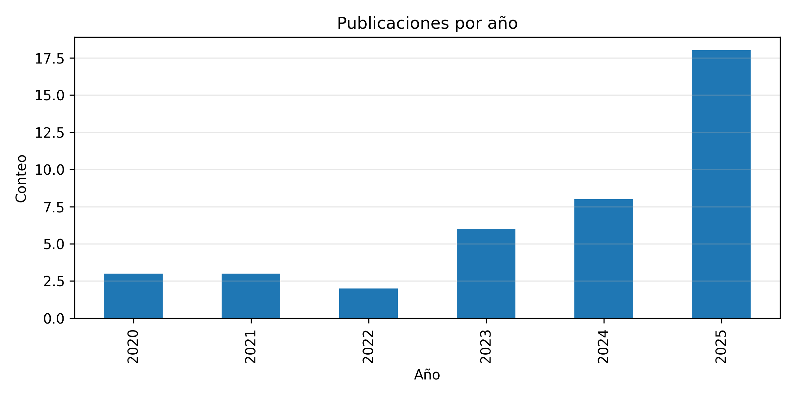
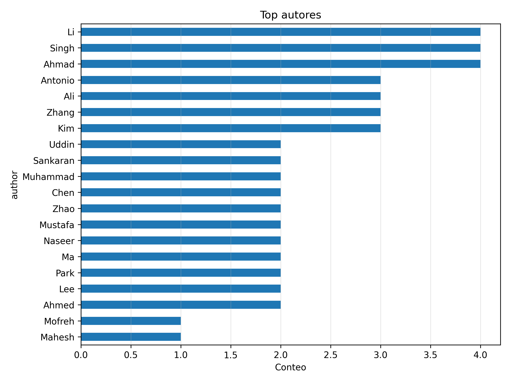
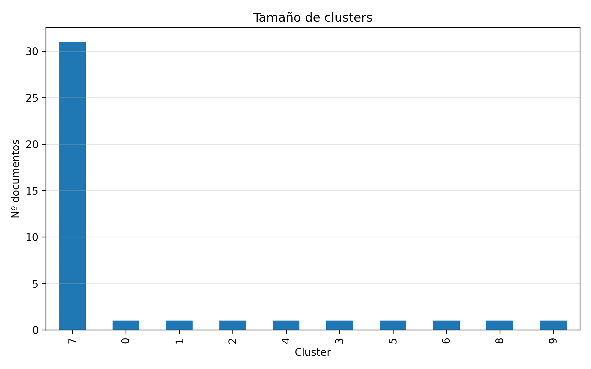
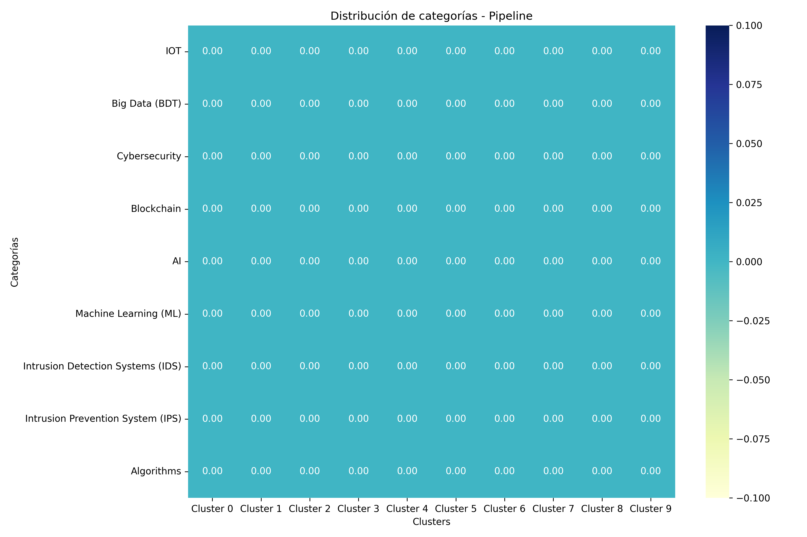
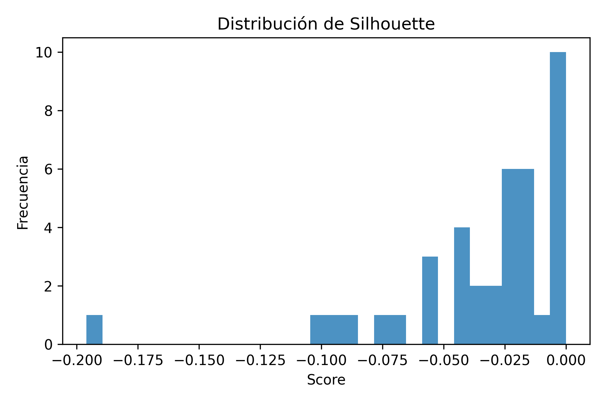

# Reporte de Pipeline

## Artefactos
- unify: {'cleaned_bib': 'C:\\Users\\Ismenia Guevara\\Documents\\Repositorios GIT\\PracticasBigData\\Entrega2\\data\\processed\\unified_cleaned.bib', 'duplicates_bib': 'C:\\Users\\Ismenia Guevara\\Documents\\Repositorios GIT\\PracticasBigData\\Entrega2\\data\\processed\\duplicates.bib', 'cleaned_csv': 'C:\\Users\\Ismenia Guevara\\Documents\\Repositorios GIT\\PracticasBigData\\Entrega2\\data\\processed\\unified_cleaned.csv'}
- nlp_csv: C:\Users\Ismenia Guevara\Documents\Repositorios GIT\PracticasBigData\Entrega2\data\processed\unified_cleaned_nlp.csv
- features: C:\Users\Ismenia Guevara\Documents\Repositorios GIT\PracticasBigData\Entrega2\data\processed\features.npz
- index: C:\Users\Ismenia Guevara\Documents\Repositorios GIT\PracticasBigData\Entrega2\outputs\search\index.pkl
- labels: C:\Users\Ismenia Guevara\Documents\Repositorios GIT\PracticasBigData\Entrega2\outputs\clustering\labels.csv
- metrics: C:\Users\Ismenia Guevara\Documents\Repositorios GIT\PracticasBigData\Entrega2\outputs\clustering\metrics.json

## Métricas de clustering
- silhouette: -0.03347134495935829
- calinski_harabasz: 1.036697148518139
- davies_bouldin: 0.9459741038647109

## Visualizaciones
### publications_per_year

### top_authors

### cluster_sizes

### category_distribution

### silhouette

### wordcloud

## Tablas generadas
- predefined_categories_counts: C:\Users\Ismenia Guevara\Documents\Repositorios GIT\PracticasBigData\Entrega2\outputs\analysis\predefined_categories_counts.csv
- predefined_categories_flags: C:\Users\Ismenia Guevara\Documents\Repositorios GIT\PracticasBigData\Entrega2\outputs\analysis\predefined_categories_flags.csv
- category_distribution: C:\Users\Ismenia Guevara\Documents\Repositorios GIT\PracticasBigData\Entrega2\outputs\analysis\category_distribution.csv
- freq_IOT: C:\Users\Ismenia Guevara\Documents\Repositorios GIT\PracticasBigData\Entrega2\outputs\analysis\freq_IOT.csv
- freq_Big Data (BDT): C:\Users\Ismenia Guevara\Documents\Repositorios GIT\PracticasBigData\Entrega2\outputs\analysis\freq_Big_Data_(BDT).csv
- freq_Cybersecurity: C:\Users\Ismenia Guevara\Documents\Repositorios GIT\PracticasBigData\Entrega2\outputs\analysis\freq_Cybersecurity.csv
- freq_Blockchain: C:\Users\Ismenia Guevara\Documents\Repositorios GIT\PracticasBigData\Entrega2\outputs\analysis\freq_Blockchain.csv
- freq_AI: C:\Users\Ismenia Guevara\Documents\Repositorios GIT\PracticasBigData\Entrega2\outputs\analysis\freq_AI.csv
- freq_Machine Learning (ML): C:\Users\Ismenia Guevara\Documents\Repositorios GIT\PracticasBigData\Entrega2\outputs\analysis\freq_Machine_Learning_(ML).csv
- freq_Intrusion Detection Systems (IDS): C:\Users\Ismenia Guevara\Documents\Repositorios GIT\PracticasBigData\Entrega2\outputs\analysis\freq_Intrusion_Detection_Systems_(IDS).csv
- freq_Intrusion Prevention System (IPS): C:\Users\Ismenia Guevara\Documents\Repositorios GIT\PracticasBigData\Entrega2\outputs\analysis\freq_Intrusion_Prevention_System_(IPS).csv
- freq_Algorithms: C:\Users\Ismenia Guevara\Documents\Repositorios GIT\PracticasBigData\Entrega2\outputs\analysis\freq_Algorithms.csv
